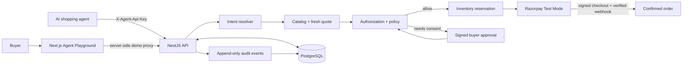

# ProtocolBridge

ProtocolBridge is a multi-tenant safety and orchestration layer for AI-initiated commerce. It lets an AI interpret a buyer's request while keeping product resolution, pricing, authorization, policy enforcement, inventory, payment, and order state deterministic and auditable.

> **AI interprets. ProtocolBridge verifies. Razorpay executes.**

This repository contains the P0 transaction foundation and the P1 golden judging experience. The conventional merchant storefront, operational admin CRM, and later protocol work planned for P2/P3 are intentionally represented only by placeholders.

## What the project demonstrates

- Natural-language purchase requests normalized into a versioned universal commerce intent.
- Fresh, database-backed product resolution and quotes.
- Tenant-scoped agents and API credentials.
- Deterministic authorization and policy checks before payment creation.
- A signed, short-lived, single-use buyer approval flow when a quote exceeds an existing limit.
- Idempotent payment and approval mutations.
- Razorpay Test Mode order creation, checkout signature verification, and webhook verification.
- Inventory reservation with variant-version checks.
- An append-only audit timeline for the complete transaction lifecycle.
- A safe demo in which a blocked transaction creates no order or payment and displays `₹0 charged`.

## Architecture



The language model, when configured, may extract search constraints only. It cannot choose the final database record, price, authorization, policy outcome, payment result, or order state. Without OpenAI configuration, the deterministic resolver supports the seeded judging request.

## Transaction lifecycle

1. An authenticated agent submits a buyer request with a unique request ID and idempotency key.
2. ProtocolBridge parses search constraints and resolves an active product variant inside the agent's merchant tenant.
3. The API creates a fresh quote using minor currency units and current inventory/version data.
4. Authorization and merchant policies are evaluated deterministically.
5. An allowed intent can be executed; the API refreshes the quote and policy before reserving inventory.
6. A request over the buyer's bound amount stops in `AWAITING_APPROVAL` before any Razorpay order or internal payment is created.
7. The matching buyer may exchange a signed ten-minute, single-use approval link for an exact `ONE_TIME` authorization bound to the intent, variant, amount, and currency.
8. Razorpay Standard Checkout may begin only after the second validation pass.
9. Checkout HMAC verification marks the payment authorized, but only an independently verified capture webhook confirms the order and consumes the one-time authorization.

## Technology

| Layer | Technology |
| --- | --- |
| Monorepo | pnpm workspaces and Turborepo |
| API | NestJS 11, TypeScript, Zod, Swagger |
| Web | Next.js 16, React 19 |
| Database | PostgreSQL 17, Prisma 6 |
| Authentication | Argon2 password hashing, JWT user sessions, hashed agent API keys |
| Payments | Razorpay Standard Checkout and signed webhooks |
| Optional AI | OpenAI intent constraint extraction with deterministic fallback |
| Tests | Vitest and Supertest |

## Repository structure

```text
.
├── apps/
│   ├── api/                 NestJS orchestration API and integration tests
│   ├── protocolbridge-web/  P1 Agent Playground and buyer approval UI
│   ├── merchant-store/      P2 merchant storefront placeholder
│   └── admin/               P2 operations/admin placeholder
├── packages/
│   ├── ai/                  Intent constraint extraction
│   ├── auth/                Password, JWT, and agent-key primitives
│   ├── authorization/       Authorization boundary evaluation
│   ├── commerce-core/       Quote and commerce domain logic
│   ├── config/              Validated environment configuration
│   ├── database/            Prisma schema, migrations, client, and seed data
│   ├── policy-engine/       Deterministic merchant policy evaluation
│   ├── razorpay/            Razorpay signing and verification helpers
│   ├── types/               Shared Zod schemas and wire contracts
│   └── ui/                  Shared checkout UI helper
├── docker-compose.yml       Local PostgreSQL service
├── pnpm-workspace.yaml      Workspace package definitions
└── turbo.json               Build, test, lint, and type-check pipeline
```

## Local setup

### Prerequisites

- Node.js 22 or newer
- pnpm 11.23.0; the exact version is pinned in `package.json`
- Docker Desktop or another Docker Engine with Compose
- Razorpay **Test Mode** credentials only if you want to complete checkout

Corepack can provide the pinned pnpm version:

```bash
corepack enable
pnpm --version
```

### 1. Install dependencies

From the repository root:

```bash
pnpm install --frozen-lockfile
```

### 2. Create the local environment file

macOS/Linux:

```bash
cp .env.example .env
```

PowerShell:

```powershell
Copy-Item .env.example .env
```

The checked-in example is suitable for local development. Replace the three placeholder application secrets with independent random values of at least 32 characters before using the app outside an isolated local environment. Never commit `.env`.

### 3. Start PostgreSQL

```bash
docker compose up -d postgres
docker compose ps
```

The container exposes PostgreSQL on host port `55432`, which avoids conflicting with a typical local installation on `5432`.

### 4. Generate the Prisma client and initialize data

```bash
pnpm db:generate
pnpm db:deploy
pnpm db:seed
```

Use `pnpm db:migrate` instead of `db:deploy` when authoring a new migration during development.

### 5. Start the workspace

```bash
pnpm dev
```

| Service | URL | Purpose |
| --- | --- | --- |
| Agent Playground | <http://localhost:3000> | P1 demo and approval UI |
| API | <http://localhost:4000/v1> | Versioned commerce API |
| Swagger | <http://localhost:4000/docs> | Interactive API documentation |
| Health | <http://localhost:4000/v1/health> | Database/provider readiness |
| Merchant Store | <http://localhost:3001> | P2 placeholder |
| Admin | <http://localhost:3002> | P2 placeholder |

The demo proxy routes are disabled unless `ENABLE_GOLDEN_DEMO=true`. Keep this flag unset or false in production.

## Environment variables

### API and infrastructure

| Variable | Required | Description |
| --- | --- | --- |
| `NODE_ENV` | Yes | `development`, `test`, or `production`. |
| `PORT` | Yes | API port; the example uses `4000`. |
| `DATABASE_URL` | Yes | PostgreSQL connection URL. |
| `JWT_SECRET` | Yes | User-token signing secret, minimum 32 characters. |
| `AGENT_CREDENTIAL_PEPPER` | Yes | Independent pepper used when hashing agent API keys, minimum 32 characters. |
| `APPROVAL_LINK_SECRET` | Yes | Independent approval-capability signing secret, minimum 32 characters. |
| `BUYER_APPROVAL_BASE_URL` | Yes | Web URL used to construct signed approval links. |
| `CORS_ORIGINS` | Yes | Comma-separated allowed browser origins. |

### Optional providers

| Variable | Rule | Description |
| --- | --- | --- |
| `OPENAI_API_KEY` | Set with `OPENAI_MODEL` or leave both empty | Enables live constraint extraction. |
| `OPENAI_MODEL` | Set with `OPENAI_API_KEY` or leave both empty | OpenAI model used by the resolver. |
| `RAZORPAY_KEY_ID` | Set all three Razorpay variables or leave all empty | Must be a Test Mode key ID; live keys are rejected. |
| `RAZORPAY_KEY_SECRET` | Same rule | Test Mode key secret used to create/verify checkout data. |
| `RAZORPAY_WEBHOOK_SECRET` | Same rule | Secret used to verify exact webhook bytes. |

### Web demo and seed fixtures

| Variable | Required for demo | Description |
| --- | --- | --- |
| `NEXT_PUBLIC_API_URL` | Yes | Browser-visible API origin; never place a secret here. |
| `API_URL` | Yes | Server-side API origin used by Next.js demo proxies. |
| `ENABLE_GOLDEN_DEMO` | Yes | Must equal `true` to enable demo reset, price, intent, and session proxies. |
| `DEMO_AGENT_API_KEY` | Yes | Server-side seeded agent credential. |
| `DEMO_BUYER_EMAIL` | Yes | Server-side buyer login used by the demo session proxy. |
| `DEMO_BUYER_PASSWORD` | Yes | Server-side buyer password used by the demo session proxy. |
| `SEED_AGENT_API_KEY` | No | Optional override for the key written by `pnpm db:seed`; keep it aligned with `DEMO_AGENT_API_KEY`. |
| `SEED_DEMO_PASSWORD` | No | Optional password override for seeded users; keep it aligned with `DEMO_BUYER_PASSWORD`. |

Configuration validation fails fast if only one OpenAI variable or only part of the Razorpay trio is supplied.

## Seeded local data

All values below are development fixtures and must be replaced outside local/demo use.

### Identities

| Role | Identifier | Credential |
| --- | --- | --- |
| Buyer | `buyer@protocolbridge.local` / `usr_demo_buyer` | `DemoPass!2026` |
| SoleKart owner | `owner@solekart.local` | `DemoPass!2026` |
| ProtocolBridge admin | `admin@protocolbridge.local` | `DemoPass!2026` |
| Demo shopping agent | `agt_demo_shopper` | `pb_test_solekart_agent_2026` |
| Merchant | `mer_solekart` | SoleKart |

### Catalog

Amounts are stored and sent as integer minor units: `189900` means `₹1,899.00`.

| Product | Variant | SKU | Initial price | Stock |
| --- | --- | --- | ---: | ---: |
| Adidas Runfalcon | Black / Size 9 | `ADI-RUNFALCON-BLK-9` | ₹1,899 | 12 |
| Nike Air Max | Black / Size 9 | `NIKE-AIRMAX-BLK-9` | ₹6,999 | 7 |
| Puma Flyer | Black / Size 9 | `PUMA-FLYER-BLK-9` | ₹2,299 | 10 |

The demo buyer has an active `MAX_AMOUNT` authorization for one item up to `₹2,000`, does not allow subscriptions, and is bound to the demo agent. Seeded merchant policies require an active agent, limit quantity, and block subscriptions.

## P1 golden demo

Open <http://localhost:3000> after completing the local setup.

1. Select **One-click demo reset**. This restores the seeded Runfalcon variant to `₹1,899` and fresh stock without deleting append-only audit history.
2. Select **Run ₹1,899 allow flow**. The request `Buy black running shoes, size 9, under ₹2,000.` resolves to the Adidas Runfalcon and returns `ALLOW`.
3. With Razorpay Test Mode configured, continue to Test Checkout. Creating a Razorpay order still shows `₹0 charged`; final confirmation requires the capture webhook.
4. Reset, then select **Raise price to ₹2,299**. The same buyer request returns `AWAITING_APPROVAL` with `MAX_AMOUNT_EXCEEDED`; no order or payment is created.
5. Generate and open the signed buyer approval link. Log in as the seeded buyer and approve the exact item and amount.
6. Return to the playground, refresh, and resume the original intent. The exact one-time authorization is consumed only after a verified payment capture.

## API surface

All routes use the `/v1` prefix. Swagger at `/docs` contains the generated OpenAPI view.

| Method | Route | Authentication | Purpose |
| --- | --- | --- | --- |
| `GET` | `/v1/health` | None | Database and optional provider readiness. |
| `POST` | `/v1/auth/login` | None | Authenticate a seeded user and return a bearer token. |
| `GET` | `/v1/auth/me` | Bearer JWT | Return the database-validated user identity. |
| `POST` | `/v1/agent/intents` | Agent API key | Resolve, quote, authorize, and policy-check an intent. |
| `GET` | `/v1/agent/intents/:intentId` | Agent API key | Read a tenant-scoped intent and audit timeline. |
| `POST` | `/v1/agent/intents/:intentId/execute` | Agent API key | Re-check state, reserve inventory, and create Test Checkout. |
| `POST` | `/v1/agent/intents/:intentId/approval-link` | Agent API key | Create/replay an exact buyer approval link. |
| `GET` | `/v1/approvals/:token` | Signed token | Inspect the approval's exact product and amount. |
| `POST` | `/v1/approvals/:token/approve` | Signed token + buyer JWT | Create an exact intent-bound one-time authorization. |
| `POST` | `/v1/payments/razorpay/verify` | Buyer JWT | Verify Standard Checkout HMAC. |
| `POST` | `/v1/webhooks/razorpay` | Razorpay signature | Verify and durably enqueue a unique webhook. |
| `POST` | `/v1/demo/reset` | Agent API key | Reset only seeded golden data; non-production only. |
| `POST` | `/v1/demo/price` | Agent API key | Select `BASELINE` or `PRICE_INCREASED`; non-production only. |

Agent-authenticated calls use `X-Agent-Api-Key`. User-authenticated calls use `Authorization: Bearer <token>`. Intent creation, execution, approval, payment verification, and demo mutations require a unique `Idempotency-Key`; reusing the key with a different body returns a conflict. Approval-link creation safely replays the existing valid link for the same intent.

### Example: create an intent

```bash
curl --request POST http://localhost:4000/v1/agent/intents \
  --header "Content-Type: application/json" \
  --header "X-Agent-Api-Key: pb_test_solekart_agent_2026" \
  --header "Idempotency-Key: readme-create-intent-001" \
  --data '{
    "requestId": "readme-request-001",
    "buyerId": "usr_demo_buyer",
    "prompt": "Buy black running shoes, size 9, under ₹2,000.",
    "protocol": "INTERNAL"
  }'
```

Only `INTERNAL` requests are implemented in P1. ACP, AP2, x402, and UAP requests fail explicitly rather than claiming compatibility.

## Database model

The Prisma schema includes users, merchants and memberships, products and variants, agents and hashed credentials, authorizations, policy rules, purchase intents and items, versioned quotes, approval requests, inventory reservations, orders and items, payments, idempotency records, webhook events, and audit events.

Migrations are committed under `packages/database/prisma/migrations`. Seed operations are upserts, so they can be safely rerun. The golden demo reset changes only the known fixture state and records the reset in the audit stream.

## Quality checks

Run the complete verification suite from the repository root:

```bash
pnpm build
pnpm typecheck
pnpm lint
pnpm test
```

The API integration tests require the PostgreSQL Compose service plus deployed migrations and seed data. They cover the `₹1,899` allowed flow, idempotency behavior, price-change blocking, exact approval/resume behavior, signed checkout verification, duplicate/out-of-order webhook handling, final order confirmation, and one-time authorization consumption.

## Security boundaries

- `.env`, build output, dependency folders, local caches, coverage, and logs are ignored by Git.
- Agent credentials are stored as peppered SHA-256 hashes; user passwords use Argon2.
- Approval URLs are signed, expire after ten minutes, are stored only as hashes, require the matching buyer, and can be exchanged once.
- Quotes and inventory carry version information to detect stale product state.
- Checkout success is not treated as captured payment; a verified Razorpay webhook is authoritative.
- Webhook signatures are checked against the exact raw request bytes and event IDs are deduplicated.
- Tenant IDs scope data access throughout agent commerce routes.
- Razorpay live-mode credentials are intentionally rejected by this P1 implementation.

The seeded passwords and agent key are public development fixtures. Rotate all credentials, use managed secrets, disable the golden demo, and review operational controls before any non-demo deployment.

## Troubleshooting

### `pnpm` is not available

Run `corepack enable`, reopen the terminal, and verify `pnpm --version` reports `11.23.0`.

### PostgreSQL cannot be reached

Run `docker compose ps` and confirm the `postgres` service is healthy. The expected host connection is `localhost:55432`. Then rerun `pnpm db:deploy`.

### The playground says the golden demo is disabled

Confirm `.env` contains `ENABLE_GOLDEN_DEMO=true`, then restart `pnpm dev`. Do not enable it in production.

### Intent creation works but checkout does not

Intent preparation can run without Razorpay. Actual Test Checkout requires all three `RAZORPAY_*` variables and a Test Mode key ID. Restart the API after updating `.env`.

### OpenAI configuration is rejected

Set both `OPENAI_API_KEY` and `OPENAI_MODEL`, or leave both empty to use the deterministic resolver.

## Current scope

- **P0:** transaction, policy, authorization, inventory, payment, idempotency, webhook, and audit foundation.
- **P1:** golden judging playground and exact buyer approval experience.
- **P2/P3:** merchant storefront, operational CRM, broader protocol adapters, and later production capabilities are not implemented yet.
